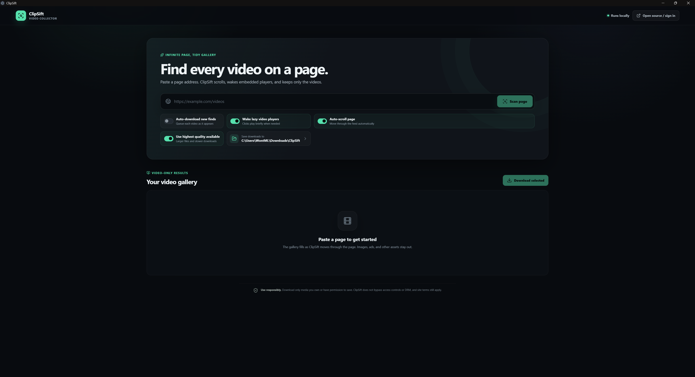

---

# TeleMass Media Downloader

Dark-mode desktop app (Python + Telethon + CustomTkinter) that mass-downloads
media from any Telegram channel/group/chat you have joined, in parallel.




## Features

- **Fast parallel downloads** — 1–16 concurrent workers over Telethon's MTProto
  connection, with `cryptg` C-accelerated crypto.
- **Media type selection** — Pictures, Videos, Files, Text (message bodies +
  captions), or All.
- **Date range** — `From` / `To` dates (local time), or leave blank for all time.
- **Channel browser** — searchable list of every chat you've joined, filterable
  by Channels / Groups.
- **Resumable** — files already downloaded (same name + size) are skipped, so
  re-running continues where you left off. Partial files use `.part` names and
  are only renamed once complete.
- **Robust** — automatic flood-wait handling, per-file retries, failures are
  counted and logged without stopping the run.
- Live progress: scanned / matched / downloaded / skipped / failed counters,
  byte totals and live speed, plus a log panel. Cancel anytime.

## Setup

```
pip install -r requirements.txt
python main.py
```

First run:

1. Get an **API ID** and **API Hash** at <https://my.telegram.org> →
   *API development tools* (any app name works).
2. Enter them in the app, press **Connect**, then enter your phone number,
   the login code Telegram sends you, and your 2FA password if you have one.
3. Your session is saved (in `%APPDATA%\TeleMassMediaDownload`), so next
   launch goes straight to the channel list.

## Usage

Pick a channel → tick media types → optionally set dates → choose a folder →
**Start Download**. Files land in
`<folder>\<channel name>\{pictures,videos,files,text}\`, named
`YYYYMMDD_HHMMSS_id<message-id>_<original-name>.<ext>` so they sort
chronologically and never collide. Text messages are written to a single
timestamped `.txt` transcript (oldest first).

## Tests

```
python -m pytest tests/
```

45 tests cover classification, date filtering, Windows-safe naming, and the
full engine pipeline (parallel workers, retries, flood-waits, skip-existing,
cancellation) against a scripted Telethon stand-in.
